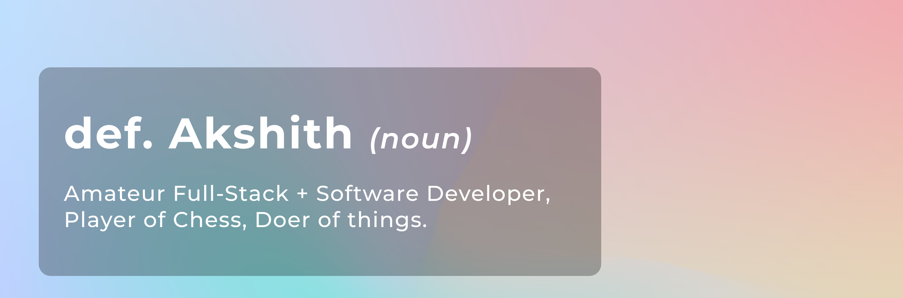

# Sup! 

Hey! My name's Akshith, 14 year old amateur full stack web developer trying to build things. High School Sophomore. Debate from time to time.

- Currently Building <a href="https://www.basically.email/">Basically.email</a>
- Trying to build cool stuff in public
- Messing with Svelte and TypeScript

## Tech Stack

I'd love for you to reach out even if you just want to say a quick hi! Don't hesitate to reach me out through any means [here!](https://linktr.ee/Bobby3105)

<!--
**Bobby3105/Bobby3105** is a ✨ _special_ ✨ repository because its `README.md` (this file) appears on your GitHub profile.

Here are some ideas to get you started:

- 🔭 I’m currently working on ...
- 🌱 I’m currently learning ...
- 👯 I’m looking to collaborate on ...
- 🤔 I’m looking for help with ...
- 💬 Ask me about ...
- 📫 How to reach me: ...
- 😄 Pronouns: ...
- ⚡ Fun fact: ...
-->
